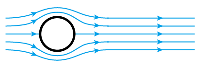

    <h1> ⛵Awesome-CFD</h1>

 

    
    
    

 
 

 
 

## 🅰资源

### 🔝微信公众号

* _**CFD之道**_
* _**CFD界**_
* _**CFD之仿真区**_
* _**南流坊**_

### 🔝其它

* CFD中文网：[https://www.cfd-china.com](https://www.cfd-china.com)
* 流体中文网：[https://www.cfluid.com](https://www.cfluid.com)
* 东岳流体Openfoam：[https://www.dyfluid.com](https://www.dyfluid.com)
* CFD-Online:[https://www.cfd-online.com](https://www.cfd-online.com)
* I do like CFD.Useful books on Computational Fluid Dynamics:[http://cfdbooks.com/](http://cfdbooks.com/)

## 🅱书籍/视频/教程

### [CFD基础知识](/CFD基础知识/)

### [前处理-Pretreatment](/前处理-Pretreatment/)

### [计算求解-Solving](/计算求解-Solving/)

### [后处理-PostProcessing](/后处理-PostProcessing/)

### License

